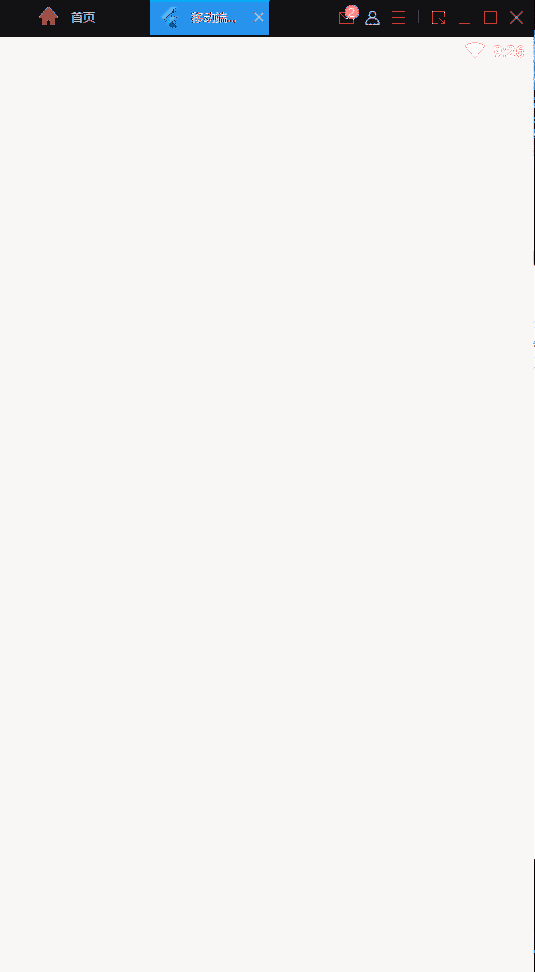

# [mobilelabelimg](./mobilelabelimg/lib/main.dart) is a  tool on mobiles to label images. It has not been finished yet.

#  mobilelabelimg will be merged into [simple-tools-for-machine-learning](https://github.com/guchengxi1994/simple-tools-for-machine-learning), there will be a refactor

# demo

## labelImg

## labelme(unfinished yet)

# how to use

## 1. clone this repo

## 2. change dir into mobilelabelimg/

## 3. run 

    flutter pub get
    flutter run --web-renderer html --no-sound-null-safety

## 4.change shapes

use this  https://github.com/guchengxi1994/mask2json/blob/master/convertmask/utils/auglib/optional/resize.py to reshape images.

# TODO

## 1.support changing image scales (maybe cannot done,hard for me)

## 2.~~save xmls~~ (done),maybe upload xmls 

## 3.next/previous button

## 4.polygon supports(labelme)
