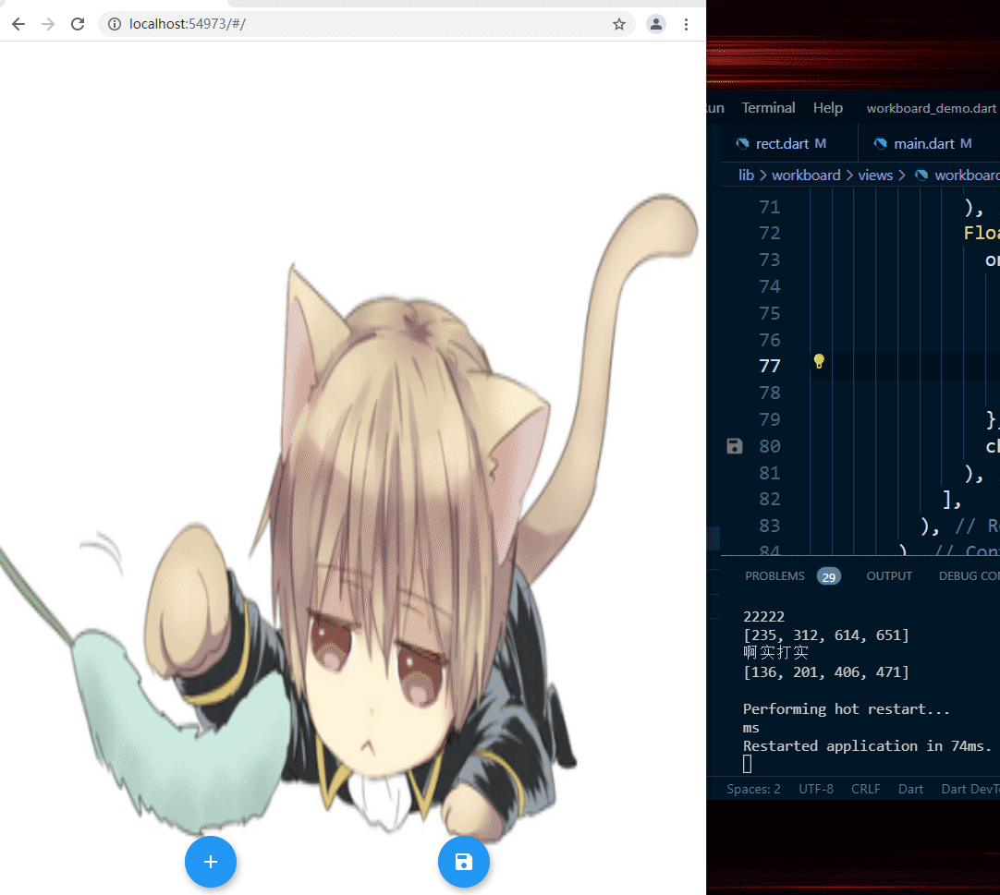

# [mobilelabelimg](./mobilelabelimg/lib/main.dart) is a  tool on mobiles to label images. It has not been finished yet.

# demo

# how to use

## 1. clone this repo

## 2. change dir into mobilelabelimg/

## 3. run 

    flutter pub get
    flutter run --web-renderer html --no-sound-null-safety

# TODO

## 1.support changing image scales

## 2.save xmls,maybe upload xmls

## 3.next/previous button

## 4.polygon supports(labelme)